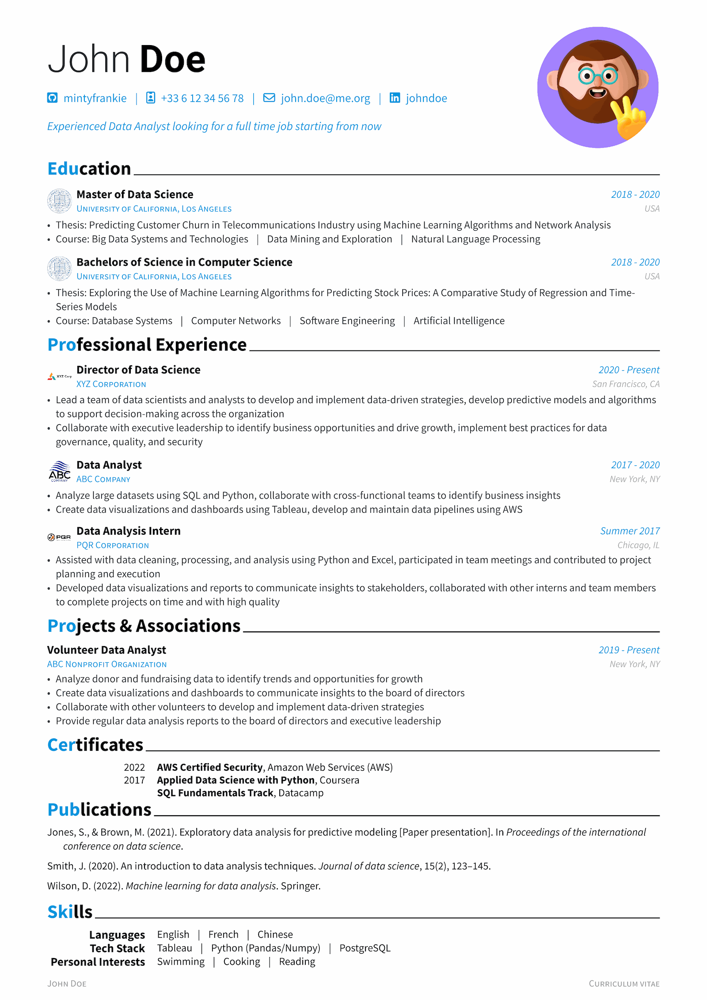

<h1 align="center">
  <br>
  
  <br>
  <br>
  Brilliant CV
  <br>
</h1>

<h4 align="center">A modern, modular, and feature-rich CV template for <a href="https://typst.app" target="_blank">Typst</a>.</h4>

<p align="center">
  <a href="https://typst.app/universe/package/brilliant-cv"></a>
  <a href="https://github.com/yunanwg/brilliant-CV/actions/workflows/test.yaml"></a>
  <a href="LICENSE"></a>
  <a href="https://github.com/yunanwg/brilliant-CV/releases"></a>
</p>

## 📖 Documentation

Full documentation (quick start, component gallery, recipes, and API reference) is available online:
**[brilliant-CV Documentation](https://yunanwg.github.io/brilliant-CV/)**

> **🆕 v4 is a breaking change.** v3 users — see the [Migration Guide](https://yunanwg.github.io/brilliant-CV/migration/) for the v3 → v4 panic-with-migration-message guards (`language`, `non_latin_font`, `[lang.<code>]`, `inject_ai_prompt`, …) and their v4 replacements.

## ✨ Key Features

- **🎨 Separation of Style & Content** — Write your CV entries in simple Typst files; the template handles the layout and styling.
- **🌍 Profile-based Variants** — Each `profile_<name>/` is a complete, self-contained CV. Switch with `--input profile=fr` at compile time. No language whitelist; any script (CJK, Arabic, Hebrew, …) configurable explicitly via `[layout.fonts]`.
- **🤖 AI & ATS Friendly** — Unique "keyword injection" feature to help your CV pass automated screening systems.
- **🛠 Highly Customizable** — Tweak colors, fonts, layout, and section highlights via per-profile `metadata.toml` files.
- **🧪 Pixel-perfect Tested** — 40+ tests (panic, unit, component, regression) run inside a Linux Docker baseline so refs are deterministic. Layout regressions can't slip past CI.
- **📦 Zero-Setup** — Get started in seconds with the Typst CLI.

<br>

## 🚀 How to Use

### 1. Initialize the Project
Run the following command in your terminal to create a new CV project:

```bash
typst init @preview/brilliant-cv
```

### 2. Pick Your Profile
Each CV variant lives in its own folder (`profile_en/`, `profile_fr/`, …). The folder holds a complete `metadata.toml` and your content `.typ` modules. Edit `profile_en/metadata.toml` first — it's the most heavily annotated.

### 3. Add Your Content
Fill in your experience, education, and skills in the `profile_<name>/*.typ` files. Each profile is **self-contained** — there is no shared root config to coordinate with.

### 4. Compile
Compile your CV to PDF:

```bash
typst compile cv.typ
```

Switch profile at compile time via the CLI:

```bash
typst compile cv.typ --input profile=fr
```

To add a new profile, copy an existing `profile_<name>/` directory and edit the fields that differ.

## ⚙️ Configuration

Each `profile_<name>/metadata.toml` is a **complete, self-contained** configuration for that CV variant — no shared root, no merging. See the [Configuration Reference](https://yunanwg.github.io/brilliant-CV/configuration/) for every field.

| Top-level table | Description |
|---|---|
| `[personal]` | Name, contact info, social links, optional `display_name` (CJK / single-string header). |
| `[personal.info]` | Per-icon contact entries — order in the file controls header order. |
| `[layout]` | Accent color, paper size, spacing skips, date column width. |
| `[layout.fonts]` | `regular_fonts` (mixed-script font chain) + `header_font`. |
| `[layout.header]` / `[layout.entry]` / `[layout.footer]` | Display toggles for photo, society-first vs role-first, page counter. |
| `[layout.section]` | `title_highlight` enum (`"first-letters"` / `"full"` / `"none"`). |
| `[inject]` | ATS keyword + custom AI-prompt injection. |
| `header_quote`, `cv_footer`, `letter_footer` | Per-profile localized strings (top-level). |

## 🖼 Gallery

| Style | Preview |
|-------|---------|
| **Standard** |  |
| **French (Red)** |  |
| **Chinese (Green)** |  |

## 🤝 Contributing

Contributions are welcome! Please check out [CONTRIBUTING.md](CONTRIBUTING.md) for guidelines.

## ❤️ Sponsors

> If this template helps you land a job, consider [buying me a coffee](https://github.com/sponsors/yunanwg)! ☕️

<p align="center">
  <!-- sponsors --><a href="https://github.com/GeorgRasumov"></a>&nbsp;&nbsp;<a href="https://github.com/chaoran-chen"></a>&nbsp;&nbsp;<!-- sponsors -->
</p>

## 📄 License

This project is licensed under the [Apache 2.0 License](LICENSE).
